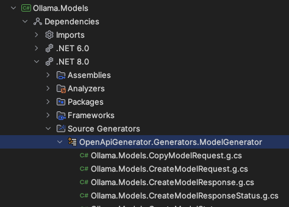

# OpenApiGenerator
Allows you to partially (for example, only models) or completely generate a native (without dependencies) C# client sdk according to the OpenAPI specification.  
Inspired by [NSwag](https://github.com/RicoSuter/NSwag) ❤️.

## 🔥Features🔥
- Uses Incremental Source Generators for efficient generation and caching.
- Detects your TargetFramework and generates optimal code for it (including net6.0/net7.0/net8.0 improvements)
- Supports .Net Framework/.Net Standard
- Does not contain dependencies for modern versions of dotnet
- Only System.Text.Json dependency for .Net Framework/.Net Standard
- Any generated methods provide the ability to pass a CancellationToken
- Allows partial generation (models only) or end points filtering
- Available under MIT license for general users and most organizations
- Uses https://github.com/microsoft/OpenAPI.NET for parsing OpenAPI specification
- Supports nullable enable/trimming/native AOT compilation
- Tested on GitHub 220k lines OpenAPI specification
- Supports OneOf/AnyOf/AllOf/Not schemas
- Supports Enums for System.Text.Json

# 🚀Quick start🚀
## CLI(Recommended)
You can use the CLI to generate the code.
```bash
dotnet tool install --global openapigenerator.cli --prerelease
rm -rf Generated
oag generate openapi.yaml \
    --namespace Namespace \
    --clientClassName YourApi \
    --targetFramework net8.0 \
    --output Generated
```
It will generate the code in the "Generated" subdirectory.  
It also will include polyfills for .Net Framework/.Net Standard TargetFrameworks.

## Source generator
- Install the package
```bash
dotnet add package OpenApiGenerator
```
- Add the following optional settings to your csproj file to customize generation. You can check all settings [here](https://github.com/HavenDV/OpenApiGenerator/blob/76c06e6e2265bc875d0619cfe96e28002fba1d3d/src/libs/OpenApiGenerator/OpenApiGenerator.props):
```xml
<!-- This generator automatically detects all .yaml files in the project directory and adds them to the generation -->
<!-- If your yaml file is not in the project directory, you can specify it manually -->
<ItemGroup Label="OpenApiGenerator">
    <AdditionalFiles Include="$(MSBuildThisFileDirectory)../../../docs/openapi.yaml" />
</ItemGroup>

<!-- All settings optional -->
<PropertyGroup Label="OpenApiGenerator">
    <OpenApiGenerator_Namespace>Ollama</OpenApiGenerator_Namespace>
    <OpenApiGenerator_ClassName>OllamaApi</OpenApiGenerator_ClassName>

    <!-- By default, it generates all models/methods. You can disable this behavior using these properties -->
    <OpenApiGenerator_GenerateSdk>false</OpenApiGenerator_GenerateSdk>
    <OpenApiGenerator_GenerateModels>true</OpenApiGenerator_GenerateModels>
    <OpenApiGenerator_GenerateMethods>true</OpenApiGenerator_GenerateMethods>
    <OpenApiGenerator_GenerateConstructors>true</OpenApiGenerator_GenerateConstructors>
    <OpenApiGenerator_IncludeOperationIds>getPet;deletePet</OpenApiGenerator_IncludeOperationIds>
    <OpenApiGenerator_ExcludeOperationIds>getPet;deletePet</OpenApiGenerator_ExcludeOperationIds>
    <OpenApiGenerator_IncludeModels>Pet;Model</OpenApiGenerator_IncludeModels>
    <OpenApiGenerator_ExcludeModels>Pet;Model</OpenApiGenerator_ExcludeModels>
</PropertyGroup>
```
- It's all! Now you can build your project and use the generated code. You also can use IDE to see the generated code in any moment, this is a example for Rider:  


# Trimming support
## Source generator
Since there are two source generators involved, we will have to create a second project so that the generator for the JsonSerializerContext will “see” our models
- Create new project for your models. And disable methods/constructors generation:
```xml
<PropertyGroup Label="OpenApiGenerator">
    <OpenApiGenerator_GenerateSdk>false</OpenApiGenerator_GenerateSdk>
    <OpenApiGenerator_GenerateModels>true</OpenApiGenerator_GenerateModels>
    <OpenApiGenerator_GenerateJsonSerializerContextTypes>true</OpenApiGenerator_GenerateJsonSerializerContextTypes>
</PropertyGroup>
```
- Reference this project in your main project.
- Add `SourceGenerationContext.cs` file to your main project with the following content:
```csharp
using System.Text.Json.Serialization;

namespace Namespace;

[JsonSourceGenerationOptions(DefaultIgnoreCondition = JsonIgnoreCondition.WhenWritingNull)]
[JsonSerializable(typeof(OpenApiGeneratorTrimmableSupport))]
internal sealed partial class SourceGenerationContext : JsonSerializerContext;
```
- Add the following settings to your main csproj file:
```xml
<PropertyGroup Label="OpenApiGenerator">
    <OpenApiGenerator_GenerateSdk>false</OpenApiGenerator_GenerateSdk>
    <OpenApiGenerator_GenerateMethods>true</OpenApiGenerator_GenerateMethods>
    <OpenApiGenerator_GenerateConstructors>true</OpenApiGenerator_GenerateConstructors>
    <OpenApiGenerator_JsonSerializerContext>Namespace.SourceGenerationContext</OpenApiGenerator_JsonSerializerContext>
</PropertyGroup>
```
- Add these settings to your new and main csproj file to enable trimming(or use Directory.Build.props file):
```xml
<PropertyGroup Label="Trimmable" Condition="$([MSBuild]::IsTargetFrameworkCompatible('$(TargetFramework)', 'net6.0'))">
    <IsAotCompatible>true</IsAotCompatible>
    <EnableTrimAnalyzer>true</EnableTrimAnalyzer>
    <IsTrimmable>true</IsTrimmable>
    <SuppressTrimAnalysisWarnings>false</SuppressTrimAnalysisWarnings>
    <TrimmerSingleWarn>false</TrimmerSingleWarn>
</PropertyGroup>
```
- It's all! Now you can build your project and use the generated code with full trimming/nativeAOT support.

## 📚Examples of use in real SDKs📚
- https://github.com/tryAGI/OpenAI
- https://github.com/tryAGI/Ollama